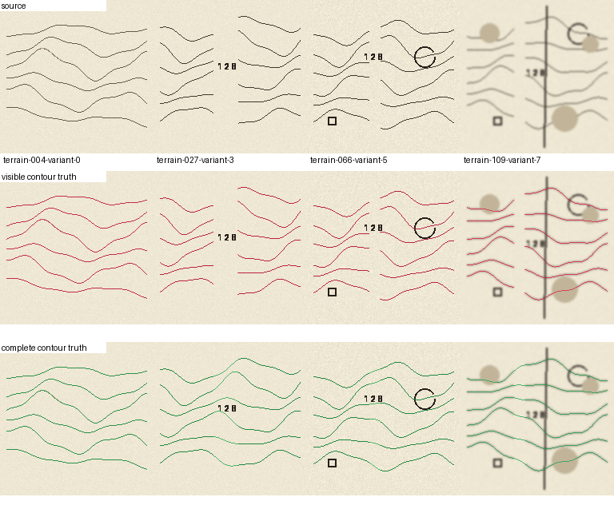

# Ink 발전·검증 워크플로

## 기준과 출처

`jap-map`은 ArchaeoTrace 플러그인을 설치하거나 호출하지 않는다. 필요한
QGIS 독립 알고리즘을 이 저장소의 `histcontour_core`에 맞춰 이식하고, 원본과
현재 기준을 함께 기록한다.

| 항목 | 고정값 |
| --- | --- |
| 원본 저장소 | `lzpxilfe/AI-Vectorizer-for-Archaeology` |
| 기준 커밋 | `f55d45da6228bd0c60e02618a2bb5031a55c54b4` |
| Ink detector 원본 blob | `edge_detector.py` `ea292be1659ee763bd16d5d08621df4788584c2c` |
| 수동 공백 연결 원본 blob | `manual_gap_bridge.py` `1bd871dd7d7c9235e356595dfa44076b5b8d20c1` |
| 회피 영역 원본 blob | `trace_guidance.py` `90282fa9a4ec79463e213a2c929f166a62217cbe` |
| Live-Wire 원본 blob | `livewire.py` `5921e78d173261d82a30ee76bdee54037f8766dc` |
| 라이선스 | 두 저장소 모두 GPL-2.0 |

이식 범위는 source-grid Ink 방향장, 부드러운 회피 비용, 명시적 양끝점
Hermite 공백 연결, 제한된 Ink 경로 탐색이다. 원본의 UI·배포·model 설치 코드나
Smart Recovery는 가져오지 않는다.

Ink 후보에는 `ink_run_id`, 입력 raster SHA-256, `segment_geometry_id`,
`segment_uid`, 원본 커밋, adapter 버전을 저장한다. 선 순번 `ink-line-N`은
표시용 호환 필드일 뿐 라벨 연결의 기준이 아니다. 새 Ink 결과가 기존 검토
레이어와 기하가 정확히 같을 때만 라벨을 옮길 수 있다.

기존 GeoPackage와 새 후보의 교집합은 아래 QGIS 실행 명령으로 먼저 보고서만
만든다. 이 명령은 라벨을 쓰지 않으며, `geometry_changed_or_removed`는 다시
검토해야 한다.

```bash
python scripts/reconcile_ink_review_labels_qgis.py \
  data/derived/annotation_package/index.json \
  data/derived/annotation_package/contour_annotations.gpkg \
  path/to/new-ink-segment-review-candidates.geojson
```

## 합성 벤치마크



120개 지형 × 8개 인쇄·스캔 변형을 고정한다. 지형 전체를 train 80개,
validation 20개, test 20개로 분리하므로 같은 지형의 변형이 다른 분할로
새지 않는다. 각 사례는 다음 truth를 따로 보관한다.

- `visible_contour`: 입력에서 실제 보이는 등고선
- `complete_contour`: 숫자·기호 공백 전의 연결선
- `non_contour`: 글자·숫자·도로·기호
- `label_gap`: 공백 복원 평가 구간

```bash
python scripts/run_synthetic_ink_experiment.py \
  --size 128 --write-cases
```

이 명령은 `synthetic_ink_experiment.json`에 고정 분할, 임계값, 검증·시험
지표를 남기고, `--write-cases`를 주면 PNG와 네 종류의 truth mask도 남긴다.
현재 로지스틱 기준 모델은 128 px 합성 run에서 test contour recall **98.96%**,
non-contour reduction **28.36%**를 기록했다. 이는 실제 고지도 정확도나
사용자 작업 시간의 근거가 아니다.

선분 주변의 세 위치와 두 배율에서 image/mask patch를 읽는 작은 CNN도
선택적으로 학습·ONNX export할 수 있다.

```bash
python scripts/train_synthetic_patch_classifier.py
```

PyTorch와 ONNX package가 있을 때만 이 명령을 실행한다. 생성된 `.onnx`와
동일 이름의 `.onnx.json`은 항상 함께 둬야 하며, QGIS는 ONNX Runtime CPU가
명시적으로 설치된 경우에만 읽는다. 선택 의존성은
`requirements-ink-ml.txt`에 기록했다.

## 실제 지도에 점수 보이기

먼저 version 2 Ink 후보를 새 폴더에 만들고, 검증된 모델을 전체 선분에 적용한다.

```bash
python scripts/generate_ink_centerline_candidates.py \
  data/derived/annotation_package/index.json

python scripts/score_ink_segments.py \
  data/derived/annotation_package/index.json \
  path/to/trained-model.json
```

두 산출물은 모두 `review_only`다. `ink_support`는 선화 지지이고
`contour_score`는 의미 분류 점수다. 둘 중 어느 것도 자동으로 `contour_gt`를
만들거나 연결선을 저장하지 않는다. feature schema·patch schema가 맞지 않는
모델은 거부한다.

QGIS Processing의 **Extract Ink Proposals / Ink 선분 추출·검토**도 같은
Ink 코어를 사용한다. 출력 `contour_score`는 선택한 JSON 기준 모델 또는
ONNX patch 모델이 있을 때에만 생성되며, 점수 레이어를 검토한 뒤에만
분류한다.

## 수동 Ink 추적

플러그인 메뉴에서 **Ink Trace / Ink 추적·라벨 공백 연결…**을 고른 뒤,
같은 CRS의 raster와 편집 가능한 선 레이어를 고른다.

1. 등고선의 시작점과 끝점을 차례로 클릭한다.
2. 초록 경로를 검토한다. `Alt`+두 번 클릭하면 글자·기호 회피 사각형을
   추가하며, 이 영역은 경로 비용만 높인다.
3. 글자 아래 실제 빈 구간에는 `G`를 눌러 명시적 양끝점 기반 공백 연결
   미리보기를 만든다. 3–128 px 거리, 접선 정렬, 우회 길이 조건을 모두
   통과해야 한다.
4. `Enter`로 edit buffer에 넣고, `Esc`로 미리보기를 취소한다. QGIS Undo로
   직전 확정을 되돌릴 수 있다.

추적 창은 원본 pixel 기준 320 px, evidence cache는 1,000 px로 제한한다.
출력 저장은 사용자가 QGIS의 **Save Layer Edits**를 실행할 때만 일어난다.
첫 구현은 north-up, axis-aligned raster의 pixel↔map 변환만 지원한다. 회전·skew
geotransform raster는 Processing Ink output을 사용하거나 등록 변환을 적용한 뒤
추적한다.

## 변경 승인과 실제 지도 평가

원본 갱신은 원본 commit/blob hash, 합성 지표, 실패 사례, 의존성 경로를
포함한 새 보고서로만 승인한다. GitHub Actions는 Ink, 합성, segment,
completion 테스트를 기본 Python job에서 실행하고 QGIS job은 UI 통합을
확인한다.

두 batch output의 개수 차이는 먼저 다음 보고서로 확인한다. 기존 검토·라벨
레이어를 덮어쓰는 명령은 아니다.

```bash
python scripts/compare_ink_runs.py \
  data/derived/annotation_package/ink_candidate_vectors/ink_candidate_vector_index.json \
  data/derived/annotation_package/ink_candidate_vectors_evidence_v2/ink_candidate_vector_index.json
```

공주 타일은 여기서도 생성·튜닝·점수 임계값 선택에 사용하지 않는다. 실제
지도에 대한 precision/recall은 사람이 검수한 ground truth가 생긴 뒤 공주
holdout에서 한 번만 측정한다.
